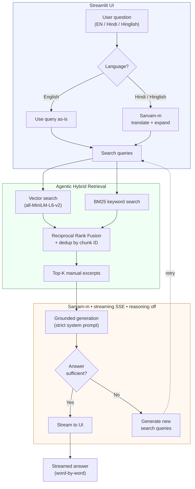

# Bike Troubleshooting Assistant

A grounded AI assistant that answers motorcycle troubleshooting and maintenance
questions using **only** the official owner's manual of the selected bike — in
English, Hindi, or Hinglish. It will not invent answers, will not use the open
web, and will politely refuse anything off-topic.

> **Live demo:** <ADD-YOUR-STREAMLIT-URL-HERE>  *(or: "Run locally — see Setup below.")*

---

## What it does

A user picks one of five popular Indian motorcycles, types a problem in plain
language — for example *"bike not starting"*, *"smoke from the exhaust"*, or
*"bike start nahi ho rahi"* — and gets a short, practical answer drawn strictly
from that bike's owner's manual.

Supported bikes: Hero Splendor Plus, Honda Shine, Bajaj Pulsar 150,
TVS Apache RTR 160 4V, Royal Enfield Classic 350.

Three behaviours define the product:

- **Grounded** — every answer comes from the manual; the model is given the
  relevant manual excerpts and instructed to use nothing else.
- **Honest** — if the manual does not cover something, it says so and points
  to an authorised service centre, rather than guessing.
- **Guarded** — off-topic questions (sports, news, chit-chat) are refused in
  one line.

---

## Architecture



### Model

| Property          | Value                    |
|-------------------|--------------------------|
| Model             | `sarvam-m`               |
| Context window    | 7,192 tokens             |
| Max output        | 500 tokens (capped)      |
| Reasoning         | Disabled (`null`)        |
| Streaming         | SSE (`stream: true`)     |

Sarvam-m was chosen over sarvam-30b for significantly faster responses
with equivalent answer quality — for grounded retrieval QA, output quality
is bounded by retrieval, not model size.

### Agentic retrieval flow

The retrieval pipeline goes beyond single-query search:

1. **Query expansion** — for Hindi/Hinglish, Sarvam-m generates a translated
   English query plus 2 alternative search phrases using manual headings and
   technical synonyms. For English, the query is used directly (no LLM call).
2. **Multi-query hybrid search** — each query runs through both vector
   (semantic) and BM25 (keyword) retrievers, fused via reciprocal-rank. Results
   are deduplicated by chunk ID and ranked by score.
3. **Self-evaluation** — if the answer contains markers like "manual does not
   cover this", the system automatically generates new search queries and
   retries once with expanded context.

---

## Setup

```bash
# 1. Install dependencies
pip install -r requirements.txt

# 2. Add your Sarvam API key
#    Copy .env.example to .env and paste your key:
#    SARVAM_API_KEY=sk_your_key_here

# 3. Build the per-bike search indexes from the manuals
python ingest.py

# 4. Run the app
streamlit run app.py
```

A free Sarvam API key is available at https://dashboard.sarvam.ai. The
embedding model runs locally and downloads automatically on first run
(~80 MB, one time).

---

## Design decisions

### 1. Pre-loaded manuals for 5 popular bikes — not user-uploaded manuals

The brief allowed either a built-in knowledge base or user uploads. **I chose
a curated, pre-loaded set of five high-market-share bikes.**

*Reasoning:* grounding quality depends on source text quality. Curated manuals
are verified, consistent, and indexed ahead of time. User-uploaded PDFs vary
enormously — scans, broken layouts, password protection — making retrieval
unreliable. The five top-selling bikes cover the largest share of Indian riders.

### 2. Sarvam-m with reasoning disabled

Sarvam fits the brief and is strong on Indian languages. For grounded retrieval
QA, chain-of-thought adds no accuracy — the answer is in the excerpts — but
adds latency and risks reasoning leaking into the reply. Reasoning is disabled
via `reasoning_effort: null`.

sarvam-m was chosen over sarvam-30b after benchmarking showed significantly
faster responses with no quality loss for this retrieval-grounded task.

### 3. Hybrid retrieval — semantic + keyword

Vector search understands intent (*"won't start"* matching ignition sections),
while BM25 catches exact terms — part names, model-specific words — that
embeddings miss. Together they retrieve more relevant excerpts than either alone.

### 4. Strict guardrails in the system prompt

The prompt enforces: answer only from excerpts; never use outside knowledge;
refuse off-topic in one sentence; quote figures exactly; and never assemble a
specification from unrelated nearby numbers. A wrong number is worse than
"not listed."

### 5. Multilingual via a preprocessing step

The system translates the *query* to English for search, then answers in the
user's language. This keeps a single English knowledge base while serving
Hindi and Hinglish users.

---

## Known limitations

- **PDF extraction is imperfect.** Tables and multi-column layouts don't always
  survive text extraction. When values are missing, the assistant correctly
  says so rather than guessing.
- **sarvam-m context window is small (7,192 tokens).** Context is capped at
  5,000 chars to stay within limits. Very complex questions that need many
  manual sections may get incomplete context.
- **Scope is the five included manuals.** Other bikes are out of scope by
  design.

---

## Project structure

```
app.py           Streamlit chat app (UI + agentic orchestration)
config.py        Central settings (bikes, chunking, retrieval, model)
ingest.py        Builds per-bike search indexes from manual PDFs
retrieval.py     Hybrid retriever (vector + BM25 + multi-query dedup)
sarvam_llm.py    Sarvam API wrapper (sync + streaming)
manuals/         The five owner's-manual PDFs
storage/         Pre-built search indexes (created by ingest.py)
.env.example     Template for the API key
```
